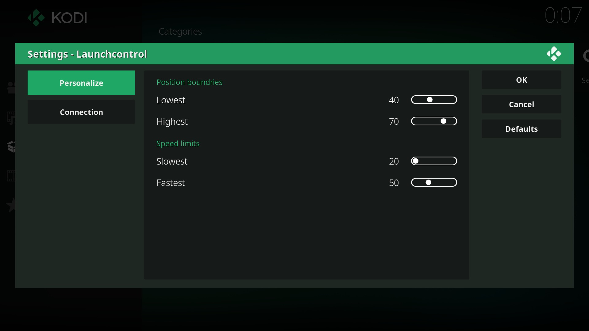

# Launchcontrol (Alpha)

[](https://godoc.org/github.com/funjack/launchcontrol)
[](https://goreportcard.com/report/github.com/funjack/launchcontrol)


Launchcontrol is a server that can control a Launch, and is meant to be used
with a plugin for an external player (eg Kodi or VLC)

Currently only Kiiroo scripts work, but the goal is to support multiple haptics
protocols/formats.

Made for Linux but should also work on a Mac. Works great on a Raspberry
Pi [LibreELEC](https://libreelec.tv/).

Requires a Launch with firmware 1.2.

## Build

```sh
go get ./...
go build
sudo setcap 'cap_net_raw,cap_net_admin=eip' ./launchcontrol
```

## Usage

```sh
# Start server (listening on localhost:6969 by default)
./launchcontrol
```

```sh
# Load and play script
curl -XPOST --data-ascii "{0.50:1,1.00:4,1.15:0,2.00:2}" \
	http://localhost:6969/v1/play
# Pause a playing script
curl http://localhost:6969/v1/pause
# Resume paused script
curl http://localhost:6969/v1/resume
# Jump to a position in the script
curl http://localhost:6969/v1/skip\?p=1m3s
# Stop and reset script
curl http://localhost:6969/v1/stop
# Start playing last loaded script
curl http://localhost:6969/v1/play
```

## Kodi Integration

The Launchcontrol Kodi service addon connects to a local Launchserver and auto
loads scripts and synchronizes playback, taking into account actions like
pausing and seeking.

Scripts that are paired with the movie file will be loaded. Pairing is done by
placing a script file next a movie using the same base filename (this mirrors
the same convention as for [nfo](http://kodi.wiki/view/NFO_files) or artwork).
The addon uses Kodi's VFS while searching and loading scripts, so even movies
on remote sources like SMB or HTTP servers will work.

**Movie/script pairing example:**

- `/my movies/title.mp4`
- `/my movies/title.kiiroo`

### Install

The plugin is located in `contrib/kodi/script.service.launchcontrol`. Just zip
up the directory (or use the Makefile.) This
[guide](http://kodi.wiki/view/HOW-TO:Install_add-ons_from_zip_files) shows how
to install the zip file in Kodi. After installation the plugin will
automatically start.

**NOTE:** If you are running Launchcontrol on another machine then Kodi or
are not using the default port, the address can be changed in the add-ons
`configure` menu.

### Raspberry Pi v2/v3 with LibreELEC

Make sure Bluetooth is **disabled** in the LibreELEC
[Services](https://wiki.libreelec.tv/index.php?title=LibreELEC_Settings#tab=Services)
tab.

Build Launchserver for [arm](https://golang.org/doc/install/source#environment):
```sh
go get ./...
GOARCH=arm GOARM=7 go build
```

Build the script addon:
```sh
make -C contrib/kodi/
```

Copy the build results and an [autostart.sh](http://wiki.openelec.tv/index.php/Autostart.sh) to the Raspberry Pi:
```sh
ssh root@libreelec 'mkdir /storage/launchcontrol'
scp launchcontrol root@libreelec:/storage/launchcontrol/
scp contrib/kodi/autostart.sh root@libreelec:/storage/.config/
scp contrib/kodi/script.service.launchcontrol.zip root@libreelec:/storage/
```

Reboot LibreELEC and
[install](http://kodi.wiki/view/HOW-TO:Install_add-ons_from_zip_files) the
`script.service.launchcontrol.zip` addon.

Thats it!



## Bluetooth requirements

See the [gatt docs](https://godoc.org/github.com/currantlabs/gatt#hdr-SETUP)
for the Bluetooth requirements/setup.

## Other examples

### Build and run example (Linux)

```sh
go build contrib/examples/playkiiroo.go
sudo setcap 'cap_net_raw,cap_net_admin=eip' ./playkiiroo
./playkiiroo -file input.txt
```

Launchcontrol is released under a [BSD-style license](./LICENSE).
